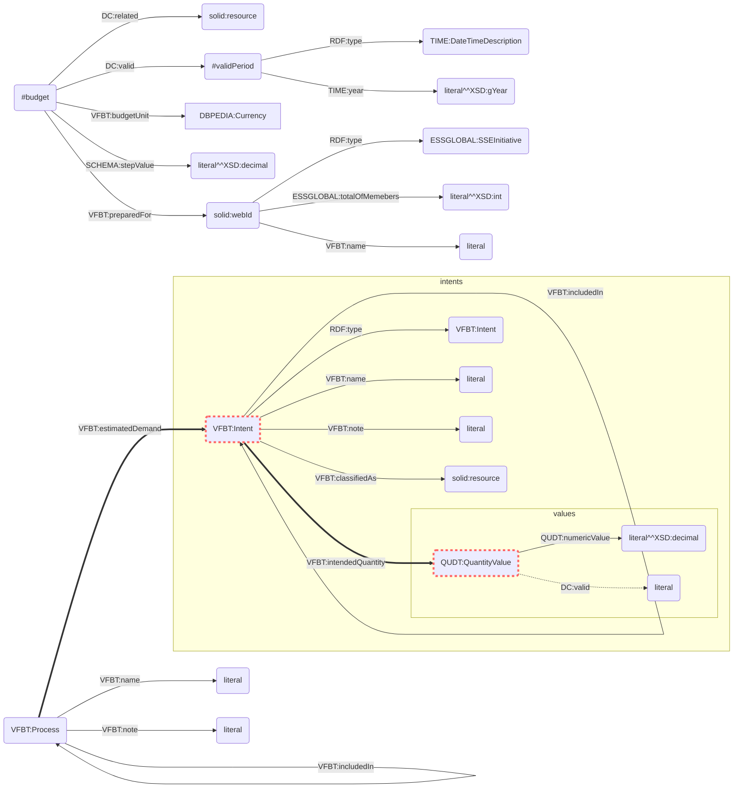
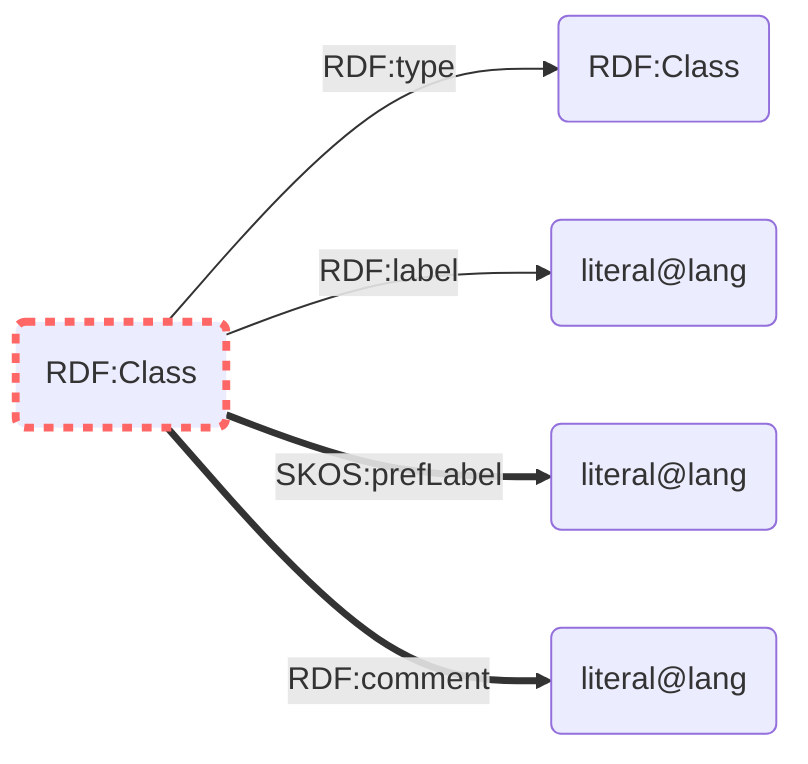

# SolidBase

The SolidBase application is a budgeting environment used for training accounting practices.

You can see it live on [app.solidbase.info](https://app.solidbase.info/).

It is part of [SolidBase](https://solidbase.info), an educational initiative about *financial sustainability for solidarity-based food systems*. Follow the link to the project page to find latest updates regarding the development of this tool.

For direct contact, you can find us

- in a messaging group at [`#solidbase:matrix.allmende.io`](https://riot.allmende.io/#/room/#solidbase:matrix.allmende.io) and
- maintaining an ongoing discourse at [SolidBase](https://discourse.solawi.allmende.io/c/SolidBase).

## Development

To develop with this repository, you must clone it to your computer and make it your working directory, for example:

    git clone git@lab.allmende.io:solidbase/solidbase.git
    cd solidbase

Initialise the dependencies of this repository with

    git submodule sync
    git submodule update --init --recursive --remote

This program uses the Node.js JavaScript runtime engine and module ecosystem. We suggest to install the latest LTS version via [nvm.sh](http://nvm.sh).

The build environment is based on [Vue.js](https://vuejs.org/). Install its command line interface globally to your system with:

    npm install -g @vue/cli

Grab the third-party Node.js modules used in this project by running:

    npm install

We can then use a set of useful helpers:

`npm run serve` compiles and hot-reloads for development

`npm run lint` lints and fixes files

`npm run build` compiles and minifies for production

### Environment

Some options can be specified with environment variables.

- `VUE_APP_I18N_LOCALE=en` The default locale
- `VUE_APP_I18N_FALLBACK_LOCALE=en` The default locale part II
- `VUE_APP_PUBLIC_SUBFOLDER="public/solidbase/"` This is the public subfolder where the public budgets will be saved. This uses the [ACL permissions](https://github.com/solid/web-access-control-spec) that are existing on the server. If the folder is nonexistant, it will be automatically created.
- `VUE_APP_PRIVATE_SUBFOLDER="private/solidbase/"` This is for the private budgets, if the `private` subfolder has *private* permissions.
- `VUE_APP_BASEID="https://base.ld.solidbase.info/profile/card#me"` This is the solid webId for the core user. All app wide settings are saved here, including expense category descriptors and the list of admins.


## Release

The release procedure of this project's build artefacts involves pushing them through a [Dokku](http://dokku.viewdocs.io/dokku/) application.  

This is automated with [gitlab CI/CD](https://docs.gitlab.com/ee/ci/README.html).

You need to specify a dokku RSA private key in the gitlab settings as `SSH_PRIVATE_KEY`.

Pushing to `develop` deploys to https://next.app.solidbase.info, while pushing to master deploys to https://app.solidbase.info.

See the [pipeline configuration file](.gitlab-ci.yml) for details.

## Persistence

The state of this application is persisted as linked open data using [SoLiD](https://solid.mit.edu/).

A dialect of the [valueflo.ws](https://w3id.org/valueflows) ontology is used for a semantic description of the budgeting data. It has been forked to be developed independently from the upstream project. [You can find it in the allmende lab.](https://lab.allmende.io/solidbase/valueflows/blob/4c6796aa9f32b145e92385a831e6c6f2b40c1b7d/release-doc-in-process/budget.ttl)

Parts of the [ESSglobal](http://purl.org/essglobal/vocab/v1.1/) ontology from [RIPESS](http://www.ripess.org/) are used to describe the type of an organisation.

We use the [vuex](https://vuex.vuejs.org/) store as interface between the application state and SoLiD. This employs using [rdflib.js](https://www.npmjs.com/package/rdflib) and [solid-auth-client](https://www.npmjs.com/package/solid-auth-client).  

To learn about representing semantic, linked open data in a machine-readable form, refer to the [Solid platform notes](https://github.com/solid/solid#solid-platform-notes), read the [Turtle intro](https://linkeddata.github.io/rdflib.js/Documentation/turtle-intro.html) and the [tutorial for using rdflib.js](https://github.com/solid/solid-tutorial-rdflib.js#tutorial-for-using-rdflibjs) for more details.

### Vocabularies

#### Budget

These are the identifiers used for storing the budgets in [solid PODs (Personal Online Data stores)]("https://en.wikipedia.org/wiki/Solid_(web_decentralization_project)#Design").  
The dotted-red box means that blank nodes are used as identifiers.




This is the context:

```turtle
@prefix DC "http://purl.org/dc/terms/"
@prefix ESSGLOBAL "http://purl.org/essglobal/vocab/v1.1/"
@prefix QUDT "http://qudt.org/schema/qudt/"
@prefix RDF "http://www.w3.org/1999/02/22-rdf-syntax-ns#"
@prefix DBPEDIA: http://dbpedia.org/resource/.
@prefix SCHEMA: http://schema.org/
@prefix TIME: http://www.w3.org/2006/time#
@prefix VFBT "https://lab.allmende.io/solidbase/valueflows/raw/plan/release-doc-in-process/budget.ttl#"
@prefix XSD: http://www.w3.org/2001/XMLSchema#.
```

##### `#budget`

The RDF descriptor `#budget` carries resource-global properties of the budgeting data. As for now we only want to enable annual budgets, `dc:valid` should carry the number of the year the budget is prepared for.
We also want to deal with single currency budgets only, so the currency can be stored as a `qudt:unit` on the global level.

##### solid:WebId

The WebID is the SoLiD authenticated agent for which the `#budget` is prepared. It is of type `essglobal:SSEInitiative`.  Its (planned) total members for the year can be defined, and a name can be set.

##### `VFBT:Process`

The `process` is all economic activity for achieving results. It transforms inputs into outputs. In its planning stage it carries `intents` with it. `Intents` for planned output, but also `intents` for planned input, of which we are most interested in its monetary value.
To enable different levels of abstraction, the *processes* can be nested (`VFBT:includedIn`) into each other. One level could be *business branch*, another *production procedure*. At least one process needs to exist, at startup it is set to the same as the budget name. This can later be changed using the *Edit Budget* modal.
For the user interface we decided to use the word **activity** as an alias, as we considered this to have the best comprehensibility.

[*Processes* on vaueflo.ws](https://www.valueflo.ws/introduction/processes.html)

##### `VFBT:Intent`

In our app we want to organize and present planned **expenses**. These are intended inputs for the processes which carry an economic value, in our case always the *price* for the **expense**.
Intents can also be nested. This allows for categorization of costs in higher level processes.
Intents are automatically inherited from a less abstract to a more abstract process.

##### `VFBT:note`

On *processes* as well as on *intents* the *notes* can be placed. These are displayed right below the chart or next to the expenses if activated.


#### Expense categories

The expense category contains translated explanatory strings for each defined expense categories. These can be edited with a [markDown editor](https://www.npmjs.com/package/easymde) on the `/config` page. Users with admin status can also edit the default texts stored on [`VUE_APP_BASEID`](#environment). This default data is copied to the normal user after first app start or when the user has deleted all expense categories.  
The location of the expense category file is hardcoded and cannot be changed from other users that are loading the budget. The location is displayed at the bottom of the `/chart` page.  

```turtle
@prefix RDF: <http://www.w3.org/2000/01/rdf-schema#>.
@prefix SKOS: <http://www.w3.org/2004/02/skos/core#>.
```
Here, the dotted-red box means that the identifiers are user editable.




## Authors

Produced by

- Gualter Baptista
- Carolin Gruber
- Anikó Haraszti
- Leoš Longauer
- Jon Richter
- Jan Valeška
- Johannes Winter

for [Solidarische Landwirtschaft e.V.](https://www.solidarische-landwirtschaft.org).

## Contributing

See the provided [contributing guidelines](./CONTRIBUTING.md) for further details about the workflow.

## License

The software SolidBase is released under the GNU Affero General Public License, Version 3.

See the provided [LICENSE](./LICENSE) file for the terms.

## Funding

Initial funding was provided by the EU through Erasmus+  
  
Disclaimer: This project has been funded with support from the European Commission.  
This publication reflects the views only of the authors, and the Commission cannot be held responsible for any use which may be made of the information contained therein.
